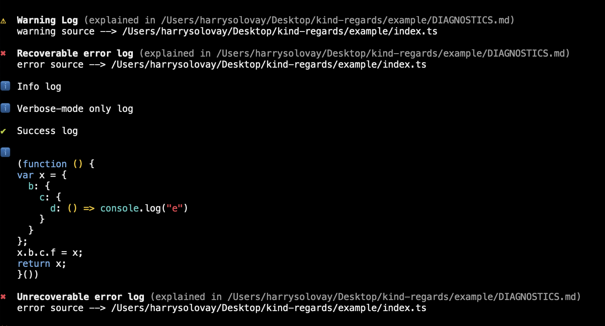

# Kind Regards,



## Why?

Because it's kind to...

- be concise when displaying varying kinds of logs to users.
- offer users `silent`, `verbose`, and `debug` modes.
- offer serialization, highlighting, and pretty-printing data (circularities included).

Between warnings, errors, one-off console logs, verbose/debug-mode logs, circular-object printing, and their related documentation... there's a lot of complexity to manage. `kind-regards` takes care of this complexity.

## Installation

```sh
npm i kind-regards
```

## Instantiation

```ts
import { Reporter } from "kind-regards";

const report = Reporter();
```

### Configuration Options

`Reporter` accepts an optional object with the following properties:

| Key | Type | Default | Description |
| :-- | :-- | :-- | :-- |
| `documentation` | `string | Falsy` | `undefined` | Relative path to API-wide documentation. |
| `silent` | `boolean | Falsy` | `undefined` | Disables all logging (which is especially useful in publicly-accessible CI/CD environments). |
| `verbose` | `boolean | Falsy` | `undefined` | When false, `report.verbose` logs will be hidden. |
| `debug` | `boolean | Falsy` | `undefined` | When false, `report.debug` logs will be hidden. |

#### For instance...

```ts
import { Reporter } from "kind-regards";
import { join } from "path";

const report = Reporter({
  verbose: true,
  debug: true,
  documentation: join(__dirname, "../README.md"),
});
```

> make sure––when publishing––to include the referenced documentation in your package
